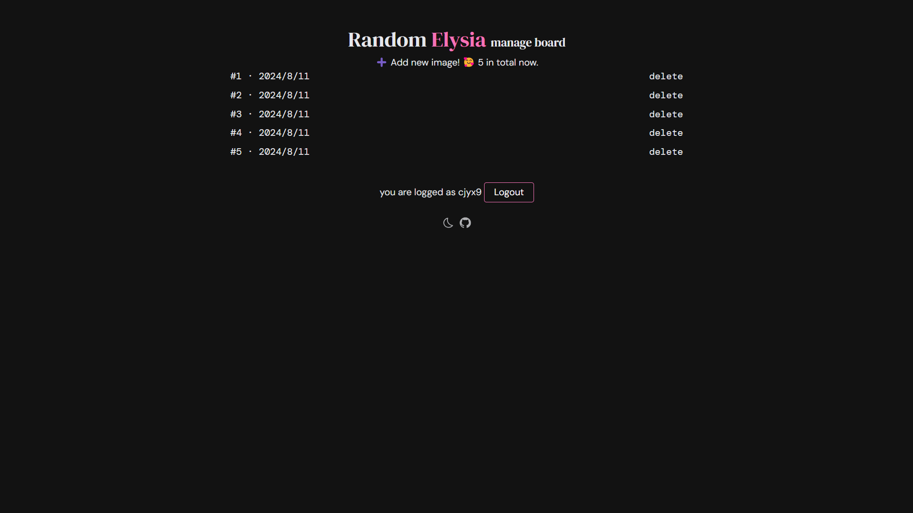

----------

# Random Elysia

Elysia.js + Drizzle ORM + Cloudflare + Vue.js full-stack template, a webapp allows you to get a random Elysia artwork 🎶.

## preview





## development

### clone repo & install deps

```bash
git clone https://github.com/nick-cjyx9/Random-Elysia.git
cd Random-Elysia
bun install
```

### Config

1. Create a d1 database

```bash
bun wrangler d1 create <name>
```

2. Configure the `.env` and `wrangler.toml` file

3. Migrate the database

```bash
bun db:generate
bun db:migrate
```

### dev & deploy

Then you can run the dev server by `bun frontend:dev` and `bun backend:dev`, or deploy the app by `bun frontend:deploy` and `bun backend:deploy`.

### Locally debug D1 database

It's a bit complex to debug the D1 database locally, cause wrangler creates a `.sqlite` file locally for `wrangler dev`, that means we need to apply migrations to the `.sqlite` file at the same time. So I prefer to deploy backend and debug the remote database. If any one can provide a better way to debug the D1 database locally, please let me know through issue or discussions.

We can start Drizzle Studio UI to easily manage the database.

```bash
bun db:studio
```

## Features

### AI tagger

We use Cloudflare AI's model to auto tag our images.

prompt: `
Please describe the pink hair girl's expression using one or several of these words which you think is most correct:
excited, happy, surprised, fear, sad, shy, disappointed, angry, neutral.
`

You can debug the prompt in the [Cloudflare Multi-model Playground](https://multi-modal.ai.cloudflare.com/)


### Bun + Elysia.js

Novel and popular js runtime. All is well, but `bun add` is too slow that I can enjoy a cup of coffee during
 installing deps.


### Show your Support

Give a ⭐️ if this project helped you!

----------------------

我永远喜欢爱莉希雅！
